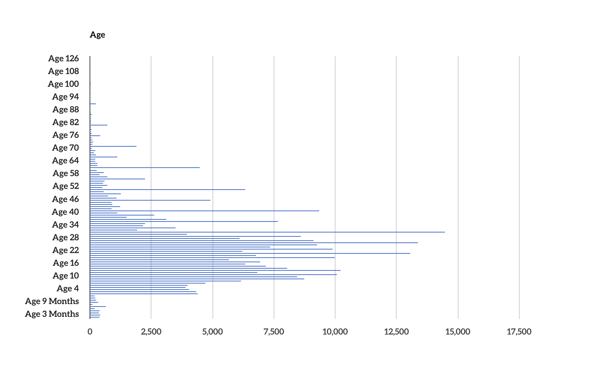

## Source

[Enslaved: Peoples of the Historical Slave Trade. Enslaved.org. Accessed October 11, 2022.](https://enslaved.org.)

## Evaluation

Enslaved.org is a digital database focused on increasing the visibility of the lives of African enslaved individuals throughout history. 
Since 2018, Enslaved.org has been a digital search engine tool for users to input the names of people, places, and events to accessibly learn more. When using this discovery hub, detailed accounts of enslaved people's stories (or, as detailed as they can be). For anybody curious about the enslaved people involved during the Historical Slave Trade, their questions about who they are, where they were from, and their impact could be answered with one search. Many datasets have incomplete information, especially with unknown names; which is still an accurate representation of the lack of availability of information on the people. Enslaved.org does their best to make this information more readily available and elevate the lives and stories of these individuals.

Visualizations of their datasets available for search can be seen below. 

Additionally, what I find extremely interesting about this project is their efforts toward transparency. The creators of Enslaved.org have many resources detailing:
<ul>
        <li> the listing of the current datasets linked in the hub </li>
        <li> information on the ontology, competency questions, metadata, controlled vocabularies, linked open data, and recommended practices </li>
        <li> the project history </li>
        <li> the project in the news and in scholarly presentations and publications </li>
</ul>

The biggest strength of this site is its ease of access and usability. Anybody can use this tool because it's represented as a simple search engine that generates the specified results for the user in an instant. However, since this website serves not only the general public but also scholars, genealogists, and other experts, it could be useful for an option for users to bookmark certain profiles to keep a log of the stories relevant for their research. This would help with localized organization and more flexible usability. 

In general, this digital database tool is driven by an important cause and is succeeding in its mission in presenting information about enslavement while maintaining respect for the enslaved persons who are at the epicenter of this work.