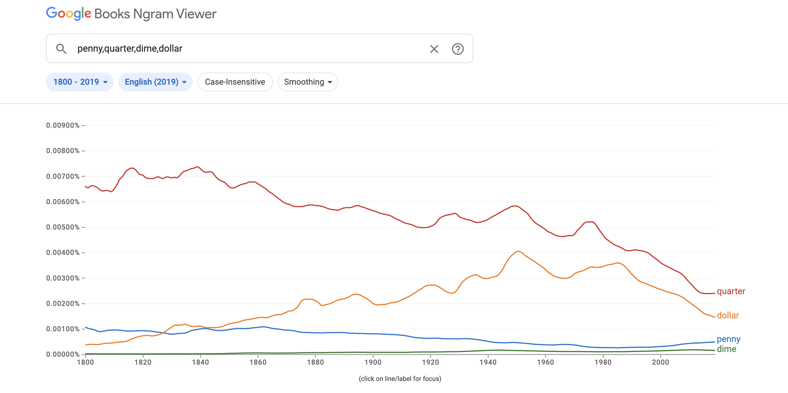
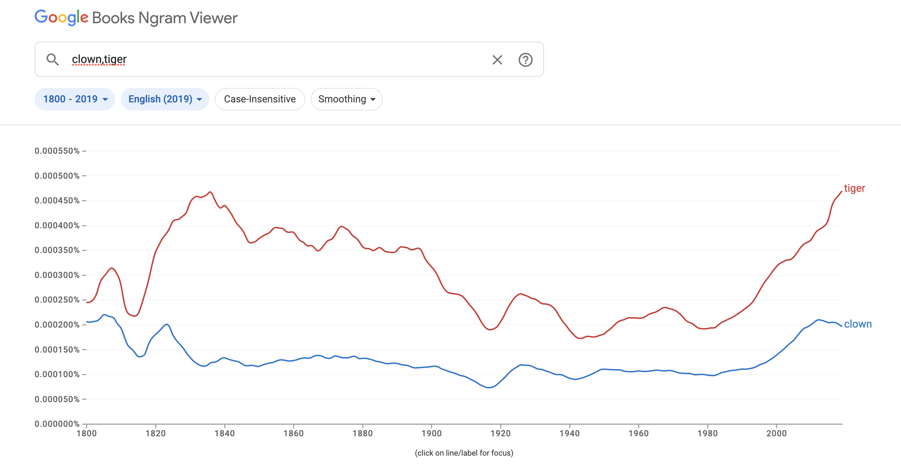

## Source

[Google Books Ngram Viewer. Google Ngram Viewer. Accessed November 28, 2022.](https://books.google.com/ngrams/.)

## Evaluation

The Google Ngram Viewer project is a text visualization tool. The Google Ngram Viewer Team, which is part of Google Research, created this text analysis tool that generates the corresponding graph showing the frequency of a given word in the Google Books database over a given range of time. The database is comprised of the text from the scanned books in Google Books and in the generated visual, the x-axis of the graph displays the specified range of years and the y-axis displays the frequency that the term/phrase appears in the corpus. The user has the ability to customize the ngrams, case sensitivity, range of time, language, and level of smoothing for visualization.

The goals of this project are to make the data visualization of any word or phrase accessible to anyone on the internet. The user is able to input multiple ngrams to see their relationship to one another and potentially inquire questions about noticeable patterns or distinctions. For instance, below is the result of when I input "penny", "quarter", "dime", and "dollar". 

I put in these terms because I was curious to see how our references to currency may have changed over the years and which were the most ubiquitous. The resulting graph makes me wonder, why did "dollar" rise as "quarter" fell and what made them both eventually decline in frequency in the late 1980s? Did a different term replace them, and if so which one? How have our references to currency evolved as the English language has been evolving?

I really enjoy using this tool because it's fun and easy to use. Since the foundation for user data input is almost limitless (though limited to the English dictionary, I suppose,) the Ngram Viewer allows for much creativity on the user's side of things. This versatility is one of the great strengths of this tool and one of the reasons why I appreciate it. For example, I could put in "clown" and "tiger" to see if their shared connection of the circus is reflected.

There does seem to be a slight trend, providing reason to believe in the presence of a relationship between the two terms, supporting the hypothesis that the resulting visual is due to their "circus" commonality.

One area where I would possibly try to improve in this site is further specificity. Google Books consists of novels, articles, anthologies, and more. Maybe there could be a way to filter the type of media for a better picture of where precisely the ngrams were present. Overall, the Ngram Viewer is a strong data visualization tool that is a pleasure to explore.
