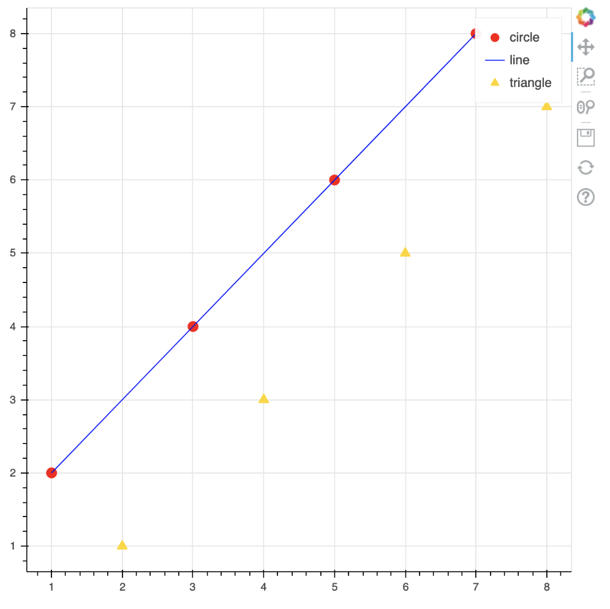
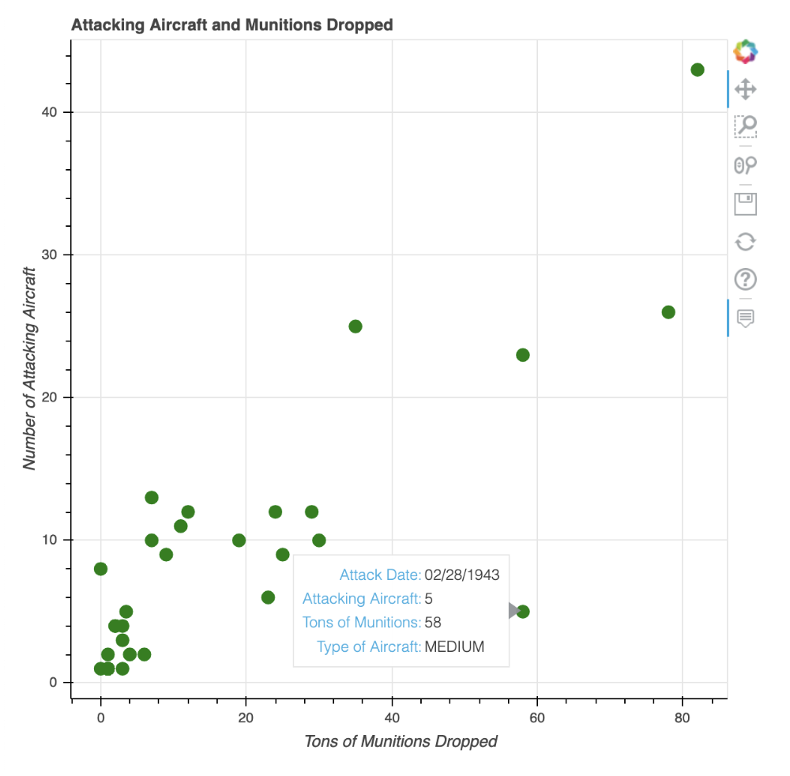
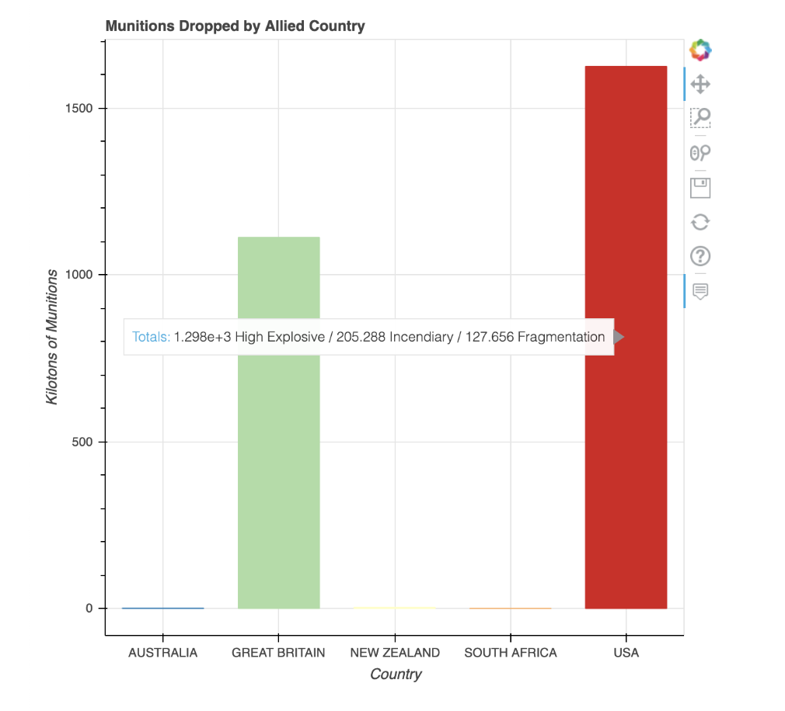
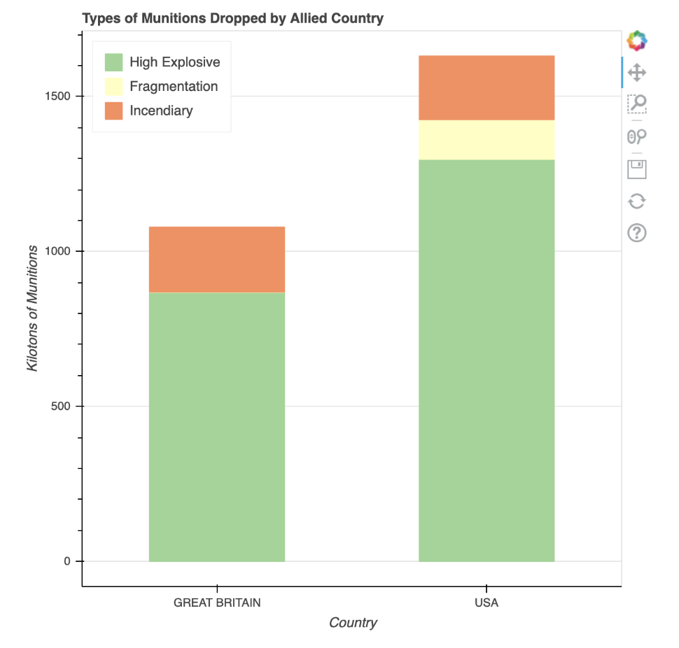
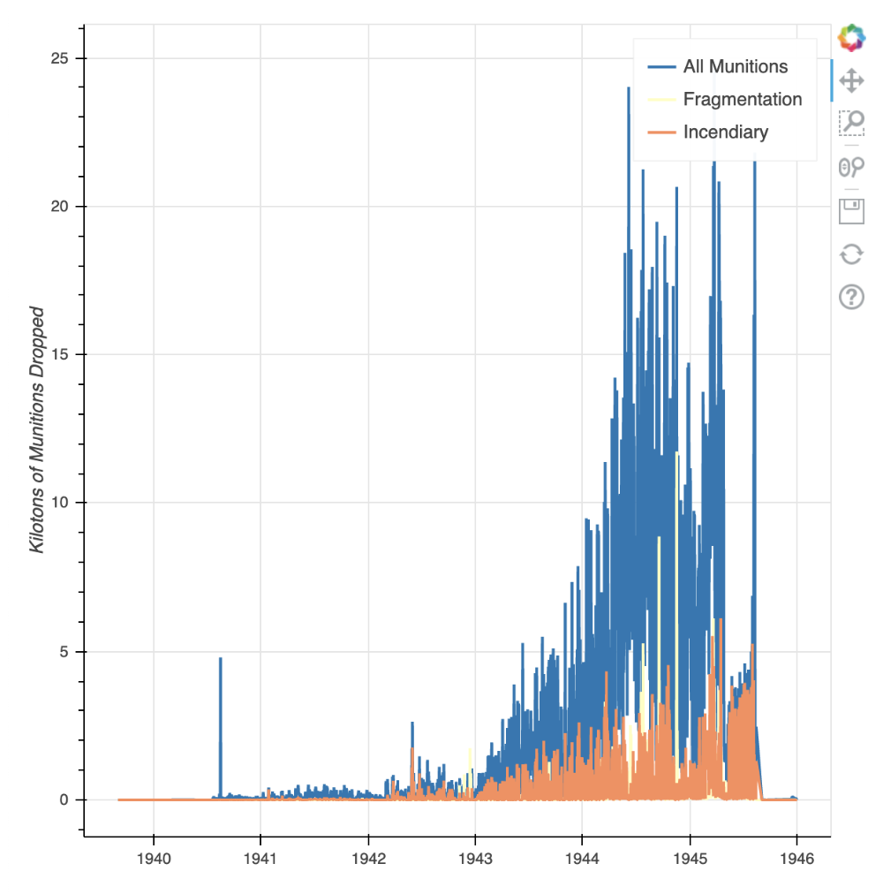
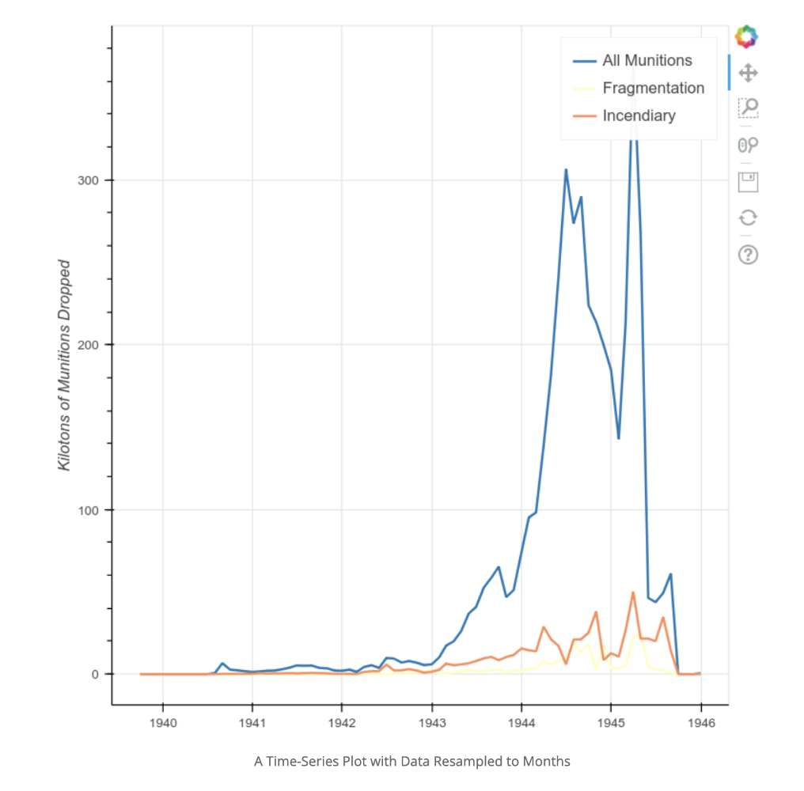
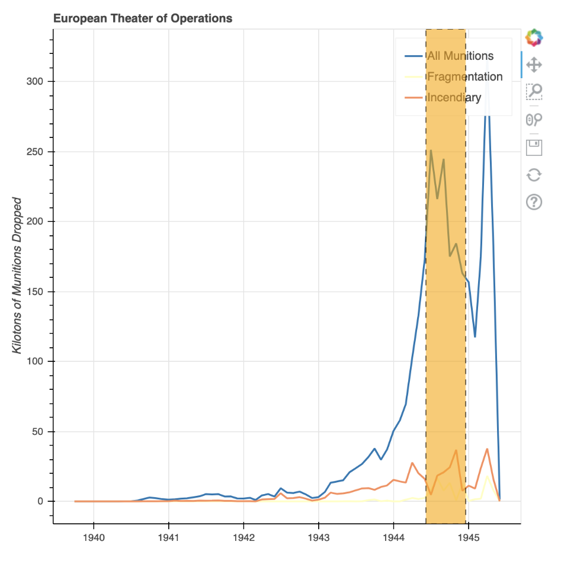
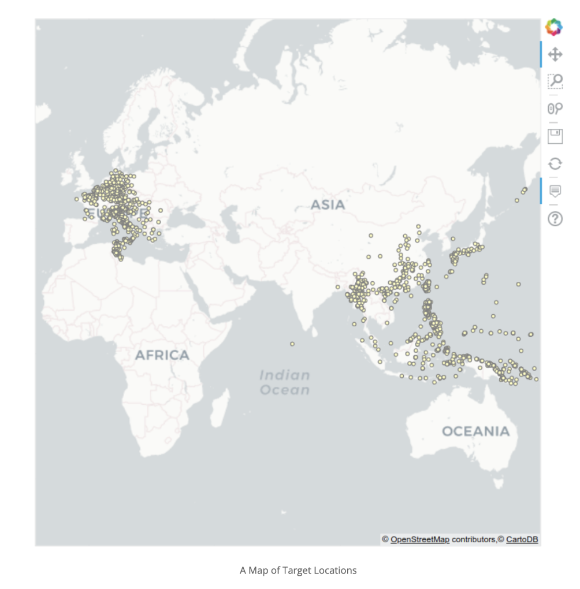

## Source

[Charlie Harper, "Visualizing Data with Bokeh and Pandas," Programming Historian 7 (2018), https://doi.org/10.46430/phen0081](https://programminghistorian.org/en/lessons/visualizing-with-bokeh)

## Reflection
Bokeh is a visualization tool that plots data on a graph in a readable and digestable way. From this Programming Historian lesson, I learned how to utilize the Bokeh and Pandas libraries to generate images that visualize my data. Bokeh is a library with the purpose of creating interactive data visualizations in a web browser. This library is special because it allows users to create not only concise and easily readable syntax, but also to show their data visualizations with rapid speed.

With any loaded tabular CSV file, I learned that I can aggregate and sub-sample raw data and even incorporate interactive elements to my data visuals like notes that appear when hovering over certain data points. The greatest strength that comes with using the Bokeh library is that it is versatile because it can show data in a wide variety of ways. This includes quantitative, categorical, and geographic data for web display. 

This lesson specifically guided me through the example of the WWII THOR Dataset which lists aerial bombing operations during World War I, World War II, the Korean War, and the Vietnam War undertaken by the United States and Allied Powers. I generated graphs that aggregated data visualizing the munitions dropped by allied countries using a scatterplot graph, a standard bar chart, a stacked bar chart, a time-series, and a map.

After completing this lesson, I feel confident enough to run the code I learned on my own CSV file and generate data visualizations that can include details like interactive annotations. I know that this lesson is only the tip of the iceberg when it comes to all the potential applications of data visualization so I'm excited to have gotten this introduction with Bokeh.
This Programming Historian lesson feels like the perfect place to start with the exploration of data visualization.


## Code

## Getting Started


```python
# installing packages
pip install pandas bokeh pyproj
pip install "pandas>=1.2.0,<1.2.3" "bokeh>=2.0.0,<2.3.0" "pyproj>=3.0,<3.0.1"
```

## Example Plot


```python
# my_first_plot.py
from bokeh.plotting import figure, output_file, show
output_file('my_first_graph.html')
```


```python
# creating data to plot
x = [1, 3, 5, 7]
y = [2, 4, 6, 8]
```


```python
# adding data to instantiated figure
p = figure()

p.circle(x, y, size=10, color='red', legend_label='circle')
p.line(x, y, color='blue', legend_label='line')
p.triangle(y, x, color='gold', size=10, legend_label='triangle')
```


<div style="display: table;"><div style="display: table-row;"><div style="display: table-cell;"><b title="bokeh.models.renderers.GlyphRenderer">GlyphRenderer</b>(</div><div style="display: table-cell;">id&nbsp;=&nbsp;'1153', <span id="1170" style="cursor: pointer;">&hellip;)</span></div></div><div class="1169" style="display: none;"><div style="display: table-cell;"></div><div style="display: table-cell;">data_source&nbsp;=&nbsp;ColumnDataSource(id='1150', ...),</div></div><div class="1169" style="display: none;"><div style="display: table-cell;"></div><div style="display: table-cell;">glyph&nbsp;=&nbsp;Triangle(id='1151', ...),</div></div><div class="1169" style="display: none;"><div style="display: table-cell;"></div><div style="display: table-cell;">hover_glyph&nbsp;=&nbsp;None,</div></div><div class="1169" style="display: none;"><div style="display: table-cell;"></div><div style="display: table-cell;">js_event_callbacks&nbsp;=&nbsp;{},</div></div><div class="1169" style="display: none;"><div style="display: table-cell;"></div><div style="display: table-cell;">js_property_callbacks&nbsp;=&nbsp;{},</div></div><div class="1169" style="display: none;"><div style="display: table-cell;"></div><div style="display: table-cell;">level&nbsp;=&nbsp;'glyph',</div></div><div class="1169" style="display: none;"><div style="display: table-cell;"></div><div style="display: table-cell;">muted&nbsp;=&nbsp;False,</div></div><div class="1169" style="display: none;"><div style="display: table-cell;"></div><div style="display: table-cell;">muted_glyph&nbsp;=&nbsp;None,</div></div><div class="1169" style="display: none;"><div style="display: table-cell;"></div><div style="display: table-cell;">name&nbsp;=&nbsp;None,</div></div><div class="1169" style="display: none;"><div style="display: table-cell;"></div><div style="display: table-cell;">nonselection_glyph&nbsp;=&nbsp;Triangle(id='1152', ...),</div></div><div class="1169" style="display: none;"><div style="display: table-cell;"></div><div style="display: table-cell;">selection_glyph&nbsp;=&nbsp;None,</div></div><div class="1169" style="display: none;"><div style="display: table-cell;"></div><div style="display: table-cell;">subscribed_events&nbsp;=&nbsp;[],</div></div><div class="1169" style="display: none;"><div style="display: table-cell;"></div><div style="display: table-cell;">tags&nbsp;=&nbsp;[],</div></div><div class="1169" style="display: none;"><div style="display: table-cell;"></div><div style="display: table-cell;">view&nbsp;=&nbsp;CDSView(id='1154', ...),</div></div><div class="1169" style="display: none;"><div style="display: table-cell;"></div><div style="display: table-cell;">visible&nbsp;=&nbsp;True,</div></div><div class="1169" style="display: none;"><div style="display: table-cell;"></div><div style="display: table-cell;">x_range_name&nbsp;=&nbsp;'default',</div></div><div class="1169" style="display: none;"><div style="display: table-cell;"></div><div style="display: table-cell;">y_range_name&nbsp;=&nbsp;'default')</div></div></div>
<script>
(function() {
  var expanded = false;
  var ellipsis = document.getElementById("1170");
  ellipsis.addEventListener("click", function() {
    var rows = document.getElementsByClassName("1169");
    for (var i = 0; i < rows.length; i++) {
      var el = rows[i];
      el.style.display = expanded ? "none" : "table-row";
    }
    ellipsis.innerHTML = expanded ? "&hellip;)" : "&lsaquo;&lsaquo;&lsaquo;";
    expanded = !expanded;
  });
})();
</script>


```python
# styling
p.legend.click_policy='hide'
show(p)
```



## Exploring the WWII THOR Dataset


```python
# loading data in pandas
import pandas as pd

url = 'https://raw.githubusercontent.com/programminghistorian/ph-submissions/gh-pages/assets/visualizing-with-bokeh/thor_wwii.csv'
df = pd.read_csv(url)
print(df)
```

               MSNDATE      THEATER COUNTRY_FLYING_MISSION    NAF   UNIT_ID  \
    0       03/30/1941          ETO          GREAT BRITAIN    RAF   84 SQDN   
    1       11/24/1940          ETO          GREAT BRITAIN    RAF  211 SQDN   
    2       12/04/1940          ETO          GREAT BRITAIN    RAF  211 SQDN   
    3       12/31/1940          ETO          GREAT BRITAIN    RAF  211 SQDN   
    4       01/06/1941          ETO          GREAT BRITAIN    RAF  211 SQDN   
    ...            ...          ...                    ...    ...       ...   
    178276  08/01/1945          PTO                    USA  20 AF     73 BW   
    178277  07/22/1942          MTO          GREAT BRITAIN    RAF       NaN   
    178278  08/17/1940  EAST AFRICA          GREAT BRITAIN    RAF   47 SQDN   
    178279  08/06/1945          PTO                    USA  20 AF    509 CG   
    178280  08/09/1945          PTO                    USA  20 AF    509 CG   
    
           AIRCRAFT_NAME  AC_ATTACKING TAKEOFF_BASE TAKEOFF_COUNTRY  \
    0           BLENHEIM          10.0          NaN             NaN   
    1           BLENHEIM           9.0          NaN             NaN   
    2           BLENHEIM           9.0          NaN             NaN   
    3           BLENHEIM           9.0          NaN             NaN   
    4           BLENHEIM           9.0          NaN             NaN   
    ...              ...           ...          ...             ...   
    178276           B29          99.0          NaN             NaN   
    178277      BLENHEIM           NaN          NaN             NaN   
    178278     WELLESLEY           6.0      ERKOWIT           SUDAN   
    178279           B29           1.0          NaN             NaN   
    178280           B29           1.0          NaN             NaN   
    
            TAKEOFF_LATITUDE  TAKEOFF_LONGITUDE TGT_COUNTRY  TGT_LOCATION  \
    0                    NaN                NaN     ALBANIA       ELBASAN   
    1                    NaN                NaN     ALBANIA       DURAZZO   
    2                    NaN                NaN     ALBANIA      TEPELENE   
    3                    NaN                NaN     ALBANIA        VALONA   
    4                    NaN                NaN     ALBANIA        VALONA   
    ...                  ...                ...         ...           ...   
    178276               NaN                NaN       JAPAN        TOYAMA   
    178277               NaN                NaN       EGYPT  MERSA MATRUH   
    178278             18.75               37.0       SUDAN       KASSALA   
    178279               NaN                NaN       JAPAN     HIROSHIMA   
    178280               NaN                NaN       JAPAN      NAGASAKI   
    
            TGT_LATITUDE  TGT_LONGITUDE  TONS_HE  TONS_IC  TONS_FRAG  TOTAL_TONS  
    0          41.100000      20.070000      0.0      0.0        0.0         0.0  
    1          41.320000      19.450000      0.0      0.0        0.0         0.0  
    2          40.300000      20.020000      0.0      0.0        0.0         0.0  
    3          40.470000      19.490000      0.0      0.0        0.0         0.0  
    4          40.470000      19.490000      0.0      0.0        0.0         0.0  
    ...              ...            ...      ...      ...        ...         ...  
    178276     36.700000     137.216667      0.0    999.0        0.0       999.0  
    178277     31.330000      27.200000      0.0      0.0        0.0      1300.0  
    178278     15.450000      36.400000   4750.0      0.0        0.0      4750.0  
    178279     34.400000     132.466667  15000.0      0.0        0.0     15000.0  
    178280     32.733333     129.866667  20000.0      0.0        0.0     20000.0  
    
    [178281 rows x 19 columns]


```python
df.columns.tolist()
```


    ['MSNDATE',
     'THEATER',
     'COUNTRY_FLYING_MISSION',
     'NAF',
     'UNIT_ID',
     'AIRCRAFT_NAME',
     'AC_ATTACKING',
     'TAKEOFF_BASE',
     'TAKEOFF_COUNTRY',
     'TAKEOFF_LATITUDE',
     'TAKEOFF_LONGITUDE',
     'TGT_COUNTRY',
     'TGT_LOCATION',
     'TGT_LATITUDE',
     'TGT_LONGITUDE',
     'TONS_HE',
     'TONS_IC',
     'TONS_FRAG',
     'TOTAL_TONS']


## Visualizing the Data (Scatterplot Graph)


```python
# creating a scatter plot
import pandas as pd
from bokeh.plotting import figure, output_file, show
from bokeh.models import ColumnDataSource
from bokeh.models.tools import HoverTool

output_file('columndatasource_example.html')

df = pd.read_csv(url)
```


```python
# load csv into dataframe
sample = df.sample(50)
source = ColumnDataSource(sample)
```


```python
# create figure object and plot data
p = figure()
p.circle(x='TOTAL_TONS', y='AC_ATTACKING',
         source=source,
         size=10, color='green')
```


<div style="display: table;"><div style="display: table-row;"><div style="display: table-cell;"><b title="bokeh.models.renderers.GlyphRenderer">GlyphRenderer</b>(</div><div style="display: table-cell;">id&nbsp;=&nbsp;'1337', <span id="1340" style="cursor: pointer;">&hellip;)</span></div></div><div class="1339" style="display: none;"><div style="display: table-cell;"></div><div style="display: table-cell;">data_source&nbsp;=&nbsp;ColumnDataSource(id='1302', ...),</div></div><div class="1339" style="display: none;"><div style="display: table-cell;"></div><div style="display: table-cell;">glyph&nbsp;=&nbsp;Circle(id='1335', ...),</div></div><div class="1339" style="display: none;"><div style="display: table-cell;"></div><div style="display: table-cell;">hover_glyph&nbsp;=&nbsp;None,</div></div><div class="1339" style="display: none;"><div style="display: table-cell;"></div><div style="display: table-cell;">js_event_callbacks&nbsp;=&nbsp;{},</div></div><div class="1339" style="display: none;"><div style="display: table-cell;"></div><div style="display: table-cell;">js_property_callbacks&nbsp;=&nbsp;{},</div></div><div class="1339" style="display: none;"><div style="display: table-cell;"></div><div style="display: table-cell;">level&nbsp;=&nbsp;'glyph',</div></div><div class="1339" style="display: none;"><div style="display: table-cell;"></div><div style="display: table-cell;">muted&nbsp;=&nbsp;False,</div></div><div class="1339" style="display: none;"><div style="display: table-cell;"></div><div style="display: table-cell;">muted_glyph&nbsp;=&nbsp;None,</div></div><div class="1339" style="display: none;"><div style="display: table-cell;"></div><div style="display: table-cell;">name&nbsp;=&nbsp;None,</div></div><div class="1339" style="display: none;"><div style="display: table-cell;"></div><div style="display: table-cell;">nonselection_glyph&nbsp;=&nbsp;Circle(id='1336', ...),</div></div><div class="1339" style="display: none;"><div style="display: table-cell;"></div><div style="display: table-cell;">selection_glyph&nbsp;=&nbsp;None,</div></div><div class="1339" style="display: none;"><div style="display: table-cell;"></div><div style="display: table-cell;">subscribed_events&nbsp;=&nbsp;[],</div></div><div class="1339" style="display: none;"><div style="display: table-cell;"></div><div style="display: table-cell;">tags&nbsp;=&nbsp;[],</div></div><div class="1339" style="display: none;"><div style="display: table-cell;"></div><div style="display: table-cell;">view&nbsp;=&nbsp;CDSView(id='1338', ...),</div></div><div class="1339" style="display: none;"><div style="display: table-cell;"></div><div style="display: table-cell;">visible&nbsp;=&nbsp;True,</div></div><div class="1339" style="display: none;"><div style="display: table-cell;"></div><div style="display: table-cell;">x_range_name&nbsp;=&nbsp;'default',</div></div><div class="1339" style="display: none;"><div style="display: table-cell;"></div><div style="display: table-cell;">y_range_name&nbsp;=&nbsp;'default')</div></div></div>
<script>
(function() {
  var expanded = false;
  var ellipsis = document.getElementById("1340");
  ellipsis.addEventListener("click", function() {
    var rows = document.getElementsByClassName("1339");
    for (var i = 0; i < rows.length; i++) {
      var el = rows[i];
      el.style.display = expanded ? "none" : "table-row";
    }
    ellipsis.innerHTML = expanded ? "&hellip;)" : "&lsaquo;&lsaquo;&lsaquo;";
    expanded = !expanded;
  });
})();
</script>


```python
# add title and label axes
p.title.text = 'Attacking Aircraft and Munitions Dropped'
p.xaxis.axis_label = 'Tons of Munitions Dropped'
p.yaxis.axis_label = 'Number of Attacking Aircraft'
```


```python
# add interactive hovering element
hover = HoverTool()
hover.tooltips=[
    ('Attack Date', '@MSNDATE'),
    ('Attacking Aircraft', '@AC_ATTACKING'),
    ('Tons of Munitions', '@TOTAL_TONS'),
    ('Type of Aircraft', '@AIRCRAFT_NAME')
]

p.add_tools(hover)

show(p)
```



## Visualizing the Data (Categorical Data and Bar Charts)


```python
# munitions_by_country.py
import pandas as pd
from bokeh.plotting import figure, output_file, show
from bokeh.models import ColumnDataSource
from bokeh.models.tools import HoverTool

from bokeh.palettes import Spectral5
from bokeh.transform import factor_cmap
output_file('munitions_by_country.html')

df = pd.read_csv(url)
```


```python
# using groupby dataframe method
grouped = df.groupby('COUNTRY_FLYING_MISSION')[['TOTAL_TONS', 'TONS_HE', 'TONS_IC', 'TONS_FRAG']].sum()
```


```python
# printing out data
print(grouped)
```

                            TOTAL_TONS     TONS_HE     TONS_IC  TONS_FRAG
    COUNTRY_FLYING_MISSION                                               
    AUSTRALIA                   479.89      453.90      13.600      18.64
    GREAT BRITAIN           1112598.95   868277.23  209036.158    1208.00
    NEW ZEALAND                2629.06     4263.70     166.500       0.00
    SOUTH AFRICA                 11.69       15.00       0.000       0.00
    USA                     1625487.68  1297955.65  205288.200  127655.98


## Plot Data


```python
# convert to kilotons
grouped = grouped / 1000
```


```python
# create a ColumnDataSource from grouped data and create a figure
source = ColumnDataSource(grouped)
countries = source.data['COUNTRY_FLYING_MISSION'].tolist()
p = figure(x_range=countries)
```


```python
# add title and label axes
color_map = factor_cmap(field_name='COUNTRY_FLYING_MISSION',
                    palette=Spectral5, factors=countries)

p.vbar(x='COUNTRY_FLYING_MISSION', top='TOTAL_TONS', source=source, width=0.70, color=color_map)

p.title.text ='Munitions Dropped by Allied Country'
p.xaxis.axis_label = 'Country'
p.yaxis.axis_label = 'Kilotons of Munitions'
```


```python
# add interactive hovering element
hover = HoverTool()
hover.tooltips = [
    ("Totals", "@TONS_HE High Explosive / @TONS_IC Incendiary / @TONS_FRAG Fragmentation")]

hover.mode = 'vline'

p.add_tools(hover)

show(p)
```



## Visualizing the Data (Stacked Bar Charts and Sub-sampling Data)


```python
# munitions_by_country_stacked.py
import pandas as pd
from bokeh.plotting import figure, output_file, show
from bokeh.models import ColumnDataSource
from bokeh.palettes import Spectral3
output_file('types_of_munitions.html')

df = pd.read_csv(url)
```


```python
# filter data
filter = df['COUNTRY_FLYING_MISSION'].isin(('USA','GREAT BRITAIN'))
df = df[filter]
```


```python
# using groupby dataframe method
grouped = df.groupby('COUNTRY_FLYING_MISSION')['TONS_IC', 'TONS_FRAG', 'TONS_HE'].sum()

#convert tons to kilotons again
grouped = grouped / 1000
```

    /var/folders/27/1zf2qqwd3j3g30sfhj13kzyh0000gp/T/ipykernel_2494/3121886858.py:2: FutureWarning: Indexing with multiple keys (implicitly converted to a tuple of keys) will be deprecated, use a list instead.
      grouped = df.groupby('COUNTRY_FLYING_MISSION')['TONS_IC', 'TONS_FRAG', 'TONS_HE'].sum()


```python
# create a ColumnDataSource from grouped data
source = ColumnDataSource(grouped)
countries = source.data['COUNTRY_FLYING_MISSION'].tolist()
p = figure(x_range=countries)
```


```python
# create stacked bar chart
p.vbar_stack(stackers=['TONS_HE', 'TONS_FRAG', 'TONS_IC'],
             x='COUNTRY_FLYING_MISSION', source=source,
             legend = ['High Explosive', 'Fragmentation', 'Incendiary'],
             width=0.5, color=Spectral3)
```

    BokehDeprecationWarning: 'legend' keyword is deprecated, use explicit 'legend_label', 'legend_field', or 'legend_group' keywords instead
    BokehDeprecationWarning: 'legend' keyword is deprecated, use explicit 'legend_label', 'legend_field', or 'legend_group' keywords instead
    BokehDeprecationWarning: 'legend' keyword is deprecated, use explicit 'legend_label', 'legend_field', or 'legend_group' keywords instead


    [GlyphRenderer(id='1637', ...),
     GlyphRenderer(id='1653', ...),
     GlyphRenderer(id='1668', ...)]


```python
# add title and label axes
p.title.text ='Types of Munitions Dropped by Allied Country'
p.legend.location = 'top_left'

p.xaxis.axis_label = 'Country'
p.xgrid.grid_line_color = None	#remove the x grid lines

p.yaxis.axis_label = 'Kilotons of Munitions'

show(p)
```



## Visualizing the Data (Time-Series and Annotations)


```python
# my_first_timeseries.py
import pandas as pd
from bokeh.plotting import figure, output_file, show
from bokeh.models import ColumnDataSource
from bokeh.palettes import Spectral3
output_file('simple_timeseries_plot.html')

df = pd.read_csv(url)

#make sure MSNDATE is a datetime format
df['MSNDATE'] = pd.to_datetime(df['MSNDATE'], format='%m/%d/%Y')

grouped = df.groupby('MSNDATE')['TOTAL_TONS', 'TONS_IC', 'TONS_FRAG'].sum()
grouped = grouped/1000

source = ColumnDataSource(grouped)

p = figure(x_axis_type='datetime')

p.line(x='MSNDATE', y='TOTAL_TONS', line_width=2, source=source, legend='All Munitions')
p.line(x='MSNDATE', y='TONS_FRAG', line_width=2, source=source, color=Spectral3[1], legend='Fragmentation')
p.line(x='MSNDATE', y='TONS_IC', line_width=2, source=source, color=Spectral3[2], legend='Incendiary')

p.yaxis.axis_label = 'Kilotons of Munitions Dropped'

show(p)
```

    /var/folders/27/1zf2qqwd3j3g30sfhj13kzyh0000gp/T/ipykernel_2494/3427792604.py:13: FutureWarning: Indexing with multiple keys (implicitly converted to a tuple of keys) will be deprecated, use a list instead.
      grouped = df.groupby('MSNDATE')['TOTAL_TONS', 'TONS_IC', 'TONS_FRAG'].sum()
    BokehDeprecationWarning: 'legend' keyword is deprecated, use explicit 'legend_label', 'legend_field', or 'legend_group' keywords instead
    BokehDeprecationWarning: 'legend' keyword is deprecated, use explicit 'legend_label', 'legend_field', or 'legend_group' keywords instead
    BokehDeprecationWarning: 'legend' keyword is deprecated, use explicit 'legend_label', 'legend_field', or 'legend_group' keywords instead




## Resampling Time-Series Data


```python
# update grouper then re-run code above
grouped = df.groupby(pd.Grouper(key='MSNDATE', freq='M'))['TOTAL_TONS', 'TONS_IC', 'TONS_FRAG'].sum()
```

    /var/folders/27/1zf2qqwd3j3g30sfhj13kzyh0000gp/T/ipykernel_2494/1362967227.py:2: FutureWarning: Indexing with multiple keys (implicitly converted to a tuple of keys) will be deprecated, use a list instead.
      grouped = df.groupby(pd.Grouper(key='MSNDATE', freq='M'))['TOTAL_TONS', 'TONS_IC', 'TONS_FRAG'].sum()




## Annotating Trends in Plots


```python
# import BoxAnnotation
from bokeh.models import BoxAnnotation
```


```python
# create a BoxAnnotation
box_left = pd.to_datetime('6-6-1944')
box_right = pd.to_datetime('16-12-1944')
                           
box = BoxAnnotation(left=box_left, right=box_right,
                    line_width=1, line_color='black', line_dash='dashed',
                    fill_alpha=0.2, fill_color='orange')

p.add_layout(box)
show(p)
```



## Spatial Data: Mapping Target Locations


```python
# target_locations.py
import pandas as pd
from bokeh.plotting import figure, output_file, show
from bokeh.models import ColumnDataSource, Range1d
from bokeh.layouts import layout
from bokeh.palettes import Spectral3
from bokeh.tile_providers import get_provider
from pyproj import Transformer
output_file('mapping_targets.html')

# helper function to convert lat/long to easting/northing for mapping
# this relies on functions from the pyproj library


def LongLat_to_EN(long, lat):
    try:
        transformer = Transformer.from_crs('epsg:4326', 'epsg:3857')
        easting, northing = transformer.transform(long, lat)
        return easting, northing
    except:
        return None, None


df = pd.read_csv(url)


df['E'], df['N'] = zip(
    *df.apply(lambda x: LongLat_to_EN(x['TGT_LONGITUDE'], x['TGT_LATITUDE']), axis=1))
```


```python
# group the data
grouped = df.groupby(['E', 'N'])[['TONS_IC', 'TONS_FRAG']].sum().reset_index()

filter = grouped['TONS_FRAG'] != 0
grouped = grouped[filter]

source = ColumnDataSource(grouped)
```


```python
# set bounds
left = -2150000
right = 18000000
bottom = -5300000
top = 11000000

p = figure(x_range=Range1d(left, right), y_range=Range1d(bottom, top))
```


```python
# add tile and use glyph methods
provider = get_provider('CARTODBPOSITRON')
p.add_tile(provider)

p.circle(x='E', y='N', source=source, line_color='grey', fill_color='yellow')

p.axis.visible = False

show(p)
```




```python

```
