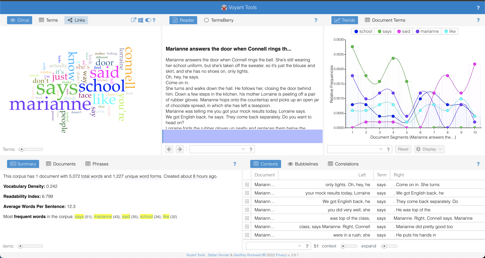

## Reflection
After learning about <a href="https://voyant-tools.org/">Voyant Tools</a>, which is a web-based text reading and analysis environment, I'll be reflecting on what I discovered from using the application with my own text of choice. This digital humanities tool is incredibly valuable for interpreting large bodies of text, and so I inputted my own text corpus: the first and last chapters of the novel <i>Normal People</i> by Sally Rooney. This is the most recent book I read and I was curious to see the similarities and differences of the writing in the beginning and end.

 <!-- image is not showing up on website -->

Once I inputted my data, I started to explore the different tools available for data visualization. The most interesting ones to me were "TextualArc" and "Knots" because they are animated visualizers that allow you to see the relation of the included words to each other. I've never used a project like this before and since I used text from a book, the highest frequency words were expectedly filler words. For instance, "says", "said", "like", "Marianne", "Connell", are the most frequently mentioned terms which makes sense when considering the overall structure of novels -- where Marianne and Connell are the main characters. There likely is a way to filter out those types of words to really distinguish the more significant words I'm looking for when comparing the first chapter and the last chapter. Such significant words would be like how in the first chapter of the novel, the word "school" is one of most frequent non-filler words, (which is representative of the textual content) and "school" is not mentioned at all in the last chapter (which also makes sense because they're older and at a different stage in life by the end). 

Exploring Voyant tools was a great experience and I had the opportunity to see the applications of digital humanities in an interactive way and to customize the inputted corpus of text.